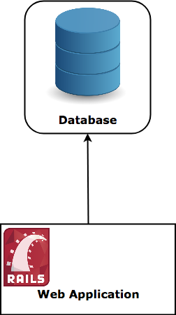

# 分布式系统概览

## 简介
### 什么是分布式系统?
一个最简单的定义是一组计算机协同工作, 而对用户来说就像是一台设备在提供服务.

这些设备共享状态, 并行运行, 一台设备出现故障不会影响到整个系统.

以数据库系统为例. 传统的数据库将数据存储在一台设备的文件系统中, 要读写信息必须直接与这台设备通信.

  
 

## 参考资料
- [A Thorough Introduction to Distributed Systems](https://hackernoon.com/a-thorough-introduction-to-distributed-systems-3b91562c9b3c)
