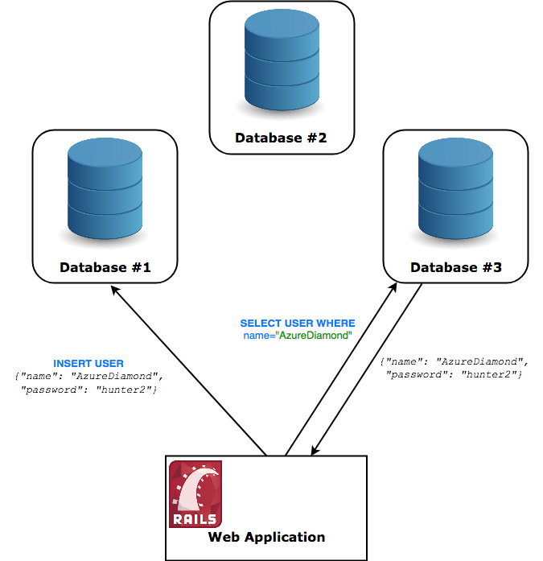
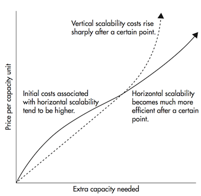
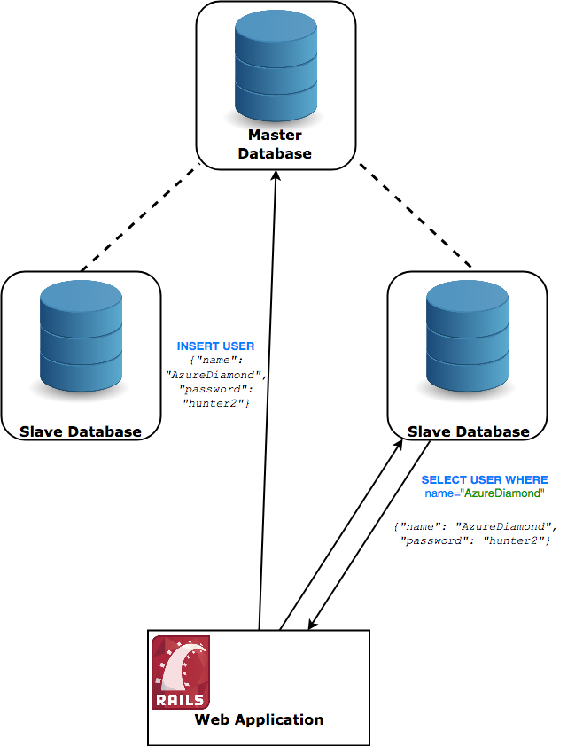
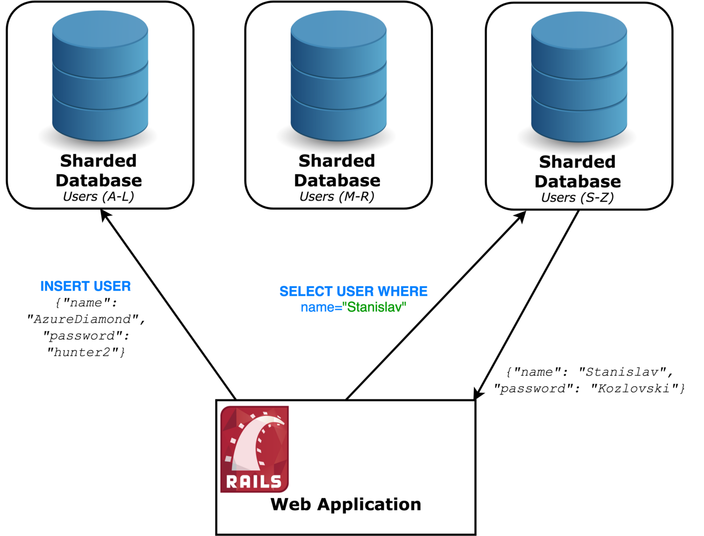
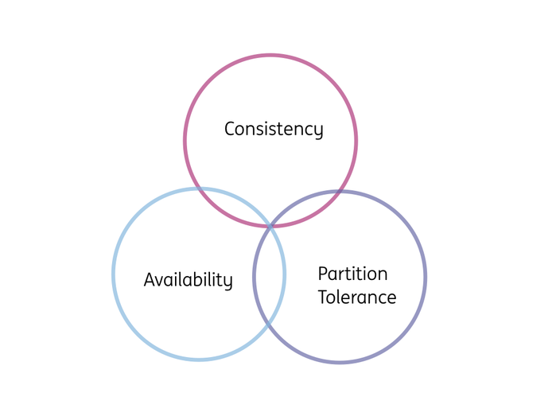
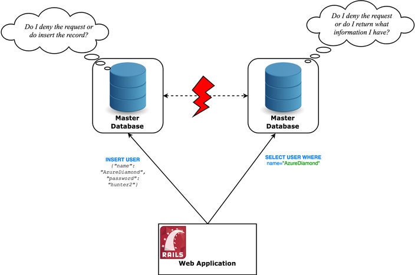

# 分布式系统概览

## 简介
### 什么是分布式系统?
一个最简单的定义是一组计算机协同工作, 而对用户来说就像是一台设备在提供服务.

这些设备共享状态, 并行运行, 一台设备出现故障不会影响到整个系统.

以数据库系统为例. 传统的数据库将数据存储在一台设备的文件系统中, 要读写信息必须直接与这台设备通信.

  
 

拓展为分布式结构, 就是要把数据库同时部署运行在多台设备上. 但是更改对用户应该是透明的, 即使每次实际操作的数据库不同, 但在感觉上还是在使用一台设备. 比如写入数据时使用的是 1 号数据库, 再从 3 号读取也能得到这条记录.

  
 

### 为什么采用分布式结构?
分布式结构会给管理带来许多麻烦, 使系统更难调试, 部署和维护. 那为什么还要用分布式呢?

答案是使用分布式架构能使系统进行横向拓展. 还拿前面的例子来说, 如果采用的是单体结构, 那么为了处理更多的请求就只能给设备更换更好的硬件, 也就是进行纵向拓展.

更换硬件很容易, 但是硬件的性能总是有上限的, 得到的边际效用会越来越低.

  
 

横向拓展则是通过增加设备来提高性能. 虽然在系统规模小的时候, 拓展成本要比纵向的方式高, 但规模达到一定程度时就能体现出它的优势:
- 成本更低;
- 拓展几乎没有上限;

除了更易于拓展, 分布式系统还具有别的优势:
- 设备集群的容错性更强;
- 信号传播的速度受限于光速, 但分布式系统使我能够把服务器部署在距客户更近的位置, 降低传播时延.

### 示例
#### 拓展我们的数据库
假设我们的应用有了很多用户, 同时数据库要接收两倍于它处理能力的请求, 这使得应用的性能急剧下降. 现在就来拓展数据库, 增加它的处理能力.

一般的应用通常执行读取操作多于写入和修改操作. 有一种叫做主从复制 (Master-Slave Replication) 的策略就可以提升读取的性能.

  
 

上面新增了两台数据库从服务器, 它们的数据与主库同步. 写入操作在主库上执行, 发生更改后它异步地通知从库, 而从库只负责处理读取请求.

这样就获得了 3 倍的处理能力.

#### 带来的问题
关系数据库事物必须具备 ACID 属性, 采用分布式结构以后立马就破坏了其中的 C, 也即一致性 (Consistency) 的要求.

比如存在这样的可能性: 先写入了一条数据, 在它同步到从数据库之前就去读取, 这样得到的数据就不是最新的.

使用分布式架构不可避免地需要权衡很多这样的取舍.

#### 继续拓展
使用主从数据库可以提升对读取请求的处理能力, 但是写入请求还是存在性能瓶颈, 因为现在仍然是一个数据库在处理.

提高写入能力的思路也是把请求分散到不同的数据库中执行.

有一个多主复制 ([Multi-master Replication](https://en.wikipedia.org/wiki/Multi-master_replication)) 的策略是这么设计的: 使用一组 master 数据库, 每个都可以同时执行写入和读取操作. 使用这种方式就必须要处理冲突, 给系统带来了很大的复杂度. 比如, 有多个请求并发地修改不同数据库中的同一条数据, 这个冲突要如何解决.

下面使用另外一种叫做分片 (sharding or partitioning) 的技术. 它的意思是说将数据库分为多个小的数据库分片 (shards), 每个分片中存储不同的记录. 所以就要制定一个规则, 确定一条记录应该存储到哪个分片中.

规则可以根据记录中的某些字段来制定, 比如使用用户名的首字母.

  
 

在分片信息的选择上需要非常慎重, 要尽量使记录均匀分布开来. 比如要是选用户的所在地作为分片依据, 就可能是大城市的用户更多, 相应的数据库要承担更大的负载.

分片后要处理更多请求的数据库叫做热点, 必须避免这种情况. 另外, 数据一旦拆开了, 想要重新划分的代价可就大了, 所以一定要慎重.

采用分片的技术, 有几台分库就能得到几倍的写入能力. 划分得越细, 性能提升得越多.

#### 带来的问题
软件工程中许多技术都是在对各种实际因素进行的取舍. 当然分片也是一样, 它在解决旧问题的同时也引入了新的问题:
- 如果要使用全局的主键, 而不是分片的主键发起请求, 就需要遍历所有分片才能找到记录;
- `JOIN` 请求几乎无法使用.

在确信必要的时候再去使用.

## 分布式系统领域

1.  分布式数据存储
    - Cassandra
1.  分布式计算
    - MapReduce
1.  分布式文件系统
    - HDFS
    - IPFS
1.  分布式消息系统
    - RabbitMQ
    - Kafka
    - Apache ActiveMQ
    - Amazon SQS
1.  分布式应用
    - Erlang Virtual Machine
    - BitTorrent
1.  分布式账本
    - Blockchain
    - Bitcoin
    - Ethereum

### 去中心化 vs. 分布式
去中心化 (decentralized) 的系统一般都是分布式 (distributed) 的, 但是它不被某个人或组织所有.

现在我们使用的许多系统虽然都采用了分布式的架构, 但是都由一个公司管理, 所以只能算是分布式的中心化系统.

### 分布式数据存储
分布式数据存储使用得最广泛, 而且就把它当作分布式数据库. 多数分布式数据库都是 NoSQL 非关系型的, 只能使用键值对的方式存取数据. 它们有很好的性能和很高的可拓展性, 代价是损失了一定的一致性或可用性.

#### CAP 定理
[CAP 定理](https://en.wikipedia.org/wiki/CAP_theorem) 指明了分布式数据存储无法同时满足一致性, 可用性和分隔容忍性.

  
 

- **C** onsistency

  每次读取到的都是最新写入的数据, 或者一个错误消息.

- **A** vailability

  每个请求都能得到响应. 响应的数据可以不是最新的, 但是不能是错误消息.

- **P** artition Tolerant

  即使在网络传输中出现了数据的延误或丢失, 系统仍能正确运行, 提供一致性或可用性的保证.

分布式系统需要通过网络互联, 而现实中又不存在可以提供绝对可靠服务的网络, 一旦网络中发生了拥塞, 甚至节点故障, 系统就可能被分割成几个无法互联的部分, 意味着分布式系统必须要考虑网络分隔, 剩下只能在一致性和可用性中选择一个满足.

设想一个由两个数据库组成的系统, 不巧数据库 1 和 2 间的网络连接中断了. 现在收到一个请求, 应该怎么办?

  
 

有两种办法:
1. 为了满足一致性, 在故障期间一律拒绝服务请求;
1. 为了满足可用性, 先处理了请求, 暂时可能导致两个数据库中的数据不一致, 等通信恢复了再去同步.

也就是要么选择 C, 要么选择 A, 而不能两个都满足.

实际的分布式存储应用在这两方面上可有侧重, 但可能追求可用性的产品多一些. 这其实是用数据不一定是最新为代价, 来换取了较短的响应时间 (为满足 C 而进行的同步过程比较费时).

这类数据库虽然达不到强一致性, 但是可以满足最终一致性 (Eventual Consistency). 也就是数据虽然不能立即同步到最新, 但是给它一段空闲处理时间, 最终总能同步到最新.

相对于传统数据库提供的 ACID 属性, 这类数据库满足的是 BASE 属性.
- **B** asically **A** vailable

  系统总是有响应.

- **S** oft state

  因为最终一致性, 系统在没有输入的情况下状态也可能变化.

- **E** ventual consistency

  在没有输入的情况下, 数据迟早会被同步到所有节点.

## 参考资料
- [A Thorough Introduction to Distributed Systems](https://hackernoon.com/a-thorough-introduction-to-distributed-systems-3b91562c9b3c)
- [You Can’t Sacrifice Partition Tolerance](https://codahale.com/you-cant-sacrifice-partition-tolerance/)
