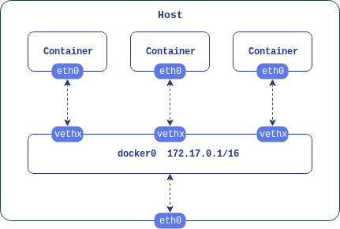

# Bridge 网络

`network namespace` 隔离了主机和容器间网络设备, 协议栈, 套接字, 路由表等网络资源. 而容器若要与主机或外界通信就要在自己的网络命令空间与主机的网络命名空间之间建立桥梁. 这可以使用虚拟以太网设备 `veth` 实现.

`veth` 总是被成对创建, 就像连接两个网络命名空间的管道, 从一头发出的数据包会被另一头收到. 在主机端的 `veth` 设备默认又连接在虚拟网桥 `docker0` 上, 它将容器网段和主机连接在了一起. 同时, `docker0` 还作为容器的默认网关.

容器与外界沟通的数据包最终要通过与外网连接的真实网卡发出.

<div align="center">  </div><br>

## 总览
`Docker` 在安装后会自动创建三种网络.
1.  查看 `Docker` 网络,
    ```
    $ docker network ls
    NETWORK ID          NAME                    DRIVER              SCOPE
    8c35f1360801        bridge                  bridge              local
    8131ec1c28f9        host                    host                local
    70e02c21cd39        none                    null                local
    ```

    命令显示了网络相关的四项信息. 其中,
    - `DRIVER` 网络使用的驱动;
    - `SCOPE` 网络的范围. `local` 说明网络只在本机使用.

    下面会说到 `bridge` 网络, 而列表中另外两个分别使用 `host` 和 `null` 驱动的网络一个用于直接与主机网络栈连接, 另一个不提供网络设备.

1.  这几个预先创建的网络是不能被删除的.
    ```
    $ docker network rm bridge host none
    Error response from daemon: bridge is a pre-defined network and cannot be removed
    Error response from daemon: host is a pre-defined network and cannot be removed
    Error response from daemon: none is a pre-defined network and cannot be removed
    ```

1.  除了使用上面三种驱动的网络, `Docker` 还支持 `macvlan` 和 `overlay` 网络驱动.
    ```
    $ docker info
    ...
    Plugins:
     Volume: local
     Network: bridge host macvlan null overlay
    ...
    ```

## 默认 bridge 网络
不同的驱动有着各自的适用场景. 其中的 `bridge` 是默认的网络驱动, 它只在本机有效, 通常在本机的多个容器间有通信需求时使用.

1.  `bridge` 驱动在底层使用了 `Linux bridge`, 查看可以使用 `brctl` 命令.
    ```
    $ brctl show
    bridge name	bridge id		STP enabled	interfaces
    docker0		8000.0242c154be7b	no		
    ```

    输出显示这里有一个叫 `docker0` 的虚拟网桥. 它是为 `bridge` 网络自动创建的, 现在还没有与任何网络接口相连接.

1.  进一步可以使用 `ip` 命令查看详细信息.
    ```
    $ ip address show docker0
    7: docker0: <NO-CARRIER,BROADCAST,MULTICAST,UP> mtu 1500 qdisc noqueue state DOWN group default
        link/ether 02:42:c1:54:be:7b brd ff:ff:ff:ff:ff:ff
        inet 172.17.0.1/16 brd 172.17.255.255 scope global docker0
           valid_lft forever preferred_lft forever
    ```

    可以看到 `docker0` 的 `IP` 地址为 `172.17.0.1/16`. `Docker` 默认在 `172.16.0.0/16` 地址段尝试创建子网, 并将地址段内的第一个地址分配给子网的路由.

## 连接到默认网络
运行新容器时如果没有特别指定, 都会连接到默认的 `bridge` 网络, 并在子网内分配 `IP` 地址.

1.  运行一个容器.
    ```
    $ docker run -d ubuntu sleep infinity
    ```
    为了使其保持运行在后台, 这里使用了 `-d` 选项和 `sleep` 命令.

1.  查看容器地址信息.
    ```
    $ docker inspect <container>
    ...
    "Gateway": "172.17.0.1",
    "GlobalIPv6Address": "",
    "GlobalIPv6PrefixLen": 0,
    "IPAddress": "172.17.0.2",
    ...
    ```

    网桥有物理和软件两种实现方式, 但不管如何实现, 它都是一个二层设备, 也就是只需要用到 `MAC` 地址来转发数据帧, 通常也不需要分配 `IP` 地址. 但是从配置中可以看到 `docker0` 还承担着路由 (`Gateway`) 的功能, 所以就必须使用 `IP` 才能正常工作.

1.  再次运行 `brctl show` 查看网桥状态.
    ```
    $ brctl show
    bridge name	bridge id		STP enabled	interfaces
    docker0		8000.0242c154be7b	no		 veth4e33df2
    ```

    现在会发现有一个网络接口连接到了 `docker0` 上.

1.  查看 `docker0` 上新连接的接口.
    ```
    $ ip a show veth2869cfe
    10: veth4e33df2@if9: <BROADCAST,MULTICAST,UP,LOWER_UP> mtu 1500 qdisc noqueue master docker0 state UP group default
        link/ether 6a:eb:cc:c4:76:93 brd ff:ff:ff:ff:ff:ff link-netnsid 0
        inet6 fe80::68eb:ccff:fec4:7693/64 scope link
           valid_lft forever preferred_lft forever
    ```

    这个接口会将 `docker0` 与新创建的容器连接起来.

1.  查看 `bridge` 网络信息, 会看到现在连接着的容器.

    ```
    $ docker network inspect bridge
    ...
    "Containers": {
        "330e9bc2c104081042b42aec2dbdb14901dde964153c866f046385fa045b6c50": {
            "Name": "wizardly_mcnulty",
            "EndpointID": "137422bed79f7423c74d8045f91ff0ba751bdd923516c2338d3c6569a75943ce",
            "MacAddress": "02:42:ac:11:00:02",
            "IPv4Address": "172.17.0.2/16",
            "IPv6Address": ""
        }
    }
    ...
    ```

1.  现在进入容器, 查看容器里的网络信息.
    ```
    $ docker exec -it wizardly_mcnulty /bin/bash
    ```

1.  可以看到是 `eth0` 这个接口分配到了地址 `172.17.0.2/16`.
    ```
    # ip a show eth0
    9: eth0@if10: <BROADCAST,MULTICAST,UP,LOWER_UP> mtu 1500 qdisc noqueue state UP group default
        link/ether 02:42:ac:11:00:02 brd ff:ff:ff:ff:ff:ff link-netnsid 0
        inet 172.17.0.2/16 brd 172.17.255.255 scope global eth0
           valid_lft forever preferred_lft forever
    ```

    事实上, 每当容器启动时, `Docker` 都会创建一对网络接口. 其中一个接口与 `docker0` 相连, 名称以 `veth` 开头, 另一个就是容器中的 `eth0` 接口. 它们就像网线的两端将 `docker0` 与容器连接了起来.

    `veth` 接口在容器关闭后就会被删除, 所以每次重启容器后接口信息都会变化.

1.  使用 `traceroute` 查看数据包的传递路径.
    ```
    # traceroute www.baidu.com
    traceroute to www.baidu.com (111.13.100.92), 30 hops max, 60 byte packets
     1  172.17.0.1 (172.17.0.1)  0.042 ms  0.015 ms  0.013 ms
     2  115.156.131.254 (115.156.131.254)  0.617 ms  0.532 ms *
    ...
    ```

    可以看到数据包首先会发送到 `172.17.0.1` 这个 `Docker` 子网的路由. 下一跳是主机默认路由.

1.  使用 `ip route` 命令查看主机路由.
    ```
    $ ip r
    default via 115.156.131.254 dev eth0
    172.17.0.0/16 dev docker0 proto kernel scope link src 172.17.0.1
    ```

    再根据第二条路由规则, 目标地址为 `172.17.0.0/16` 的数据包会从 `docker0` 接口发出, 然后就送到对应的容器中了.


如果建立了多个网桥, 每个都与主机相连, 那连接在不同网桥上的容器还是能彼此通信, 达不到隔离的效果. 不过, `Docker` 网桥驱动会自动在主机上添加网络规则, 使连接到不同网桥的容器不能直接通信.

## 用户定义网络
1.  使用 `docker network create` 命令可以创建用户定义网络.

    ```
    $ docker network create \
    > --subnet=172.18.0.0/16 \
    > --ip-range=172.18.1.0/24 \
    > --gateway=172.18.1.254 \
    > my-net
    ```

    在上面的命令中新建了名为 `my-net` 的网络, 并指定了子网号, `IP` 范围和路由地址. 因为没有指定网络驱动, 所以会使用默认的 `bridge`.

1.  查看网络.
    ```
    $ docker network ls
    NETWORK ID          NAME                DRIVER              SCOPE
    a5869608ffd1        my-net              bridge              local
    ...
    ```

1.  查看新增的路由信息.
    ```
    $ ip r
    172.18.0.0/16 dev br-a5869608ffd1 proto kernel scope link src 172.18.1.254
    ...
    ```

1.  删除网络.
    ```
    $ docker network rm my-net
    ```

## 连接到用户定义网络
用户定义网络需要显式指定才能连接.

1.  启动一个容器连接到 `my-net`.
    ```
    $ docker run -dt --network my-net ubuntu sleep infinity
    ```

1.  连接后会创建网桥和以 `veth` 开头的网络接口.
    ```
    $ brctl show
    bridge name	bridge id		STP enabled	interfaces
    br-a5869608ffd1		8000.024232663b27	no		vethdec0fbe
    ...
    ```

1.  断开连接.
    ```
    $ docker network disconnect my-net relaxed_yalow
    ```

## 用户网络和默认网络的区别

> 下面将用户定义网桥网络和默认网桥网络简称为用户网络和默认网络.

- **用户定义能提供更好的隔离性, 同时容器间可以更好地协作.**

  连接在同一个用户定义网络上的容器彼此间会开放所有的端口, 同时又不会把端口暴露给外界.

  如果使用默认网络, 容器间若要通信就必须使用 `-p` 选项指定端口, 但同时也意味着这个端口可以被外部访问.

- **用户定义网络具有 `DNS` 功能.**

  连接在用户网络上的容器可以使用彼此的容器名或别名通信. 在默认网络中则要使用 `IP` 地址.

- **容器可以在运行中连接或断开用户网络.**

  如果使用默认网络则要重新创建一个容器.

- **每个用户网络都有一个可配置的网桥.**

  默认网络虽然也可以配置, 但修改会影响到所有使用它的容器. 此外, 修改是发生在 `Docker` 之外的.

  使用用户网络就可以对需求不同的一组容器进行定制, 而且 `Docker` 就提供了相应的命令 `docker network create`.

- **在默认网络上使用 `--link` 选项相连接的容器共享环境变量.**

  在用户网络中则要使用其他方式.

## Cheet Sheet
```shell
# docker 网络的相关操作
$ docker network
$ docker network ls
$ docker network rm bridge
$ docker network inspect bridge
$ docker network create my-net
$ docker network connect my-net ubuntu
$ docker network disconnect my-net ubuntu

# 查看 docker 信息
$ docker info

# 安装网桥管理工具
$ sudo apt install bridge-utils
# 显示网桥
$ brctl show

# 使用 ip 命令前需要安装 iproute2
$ sudo apt install iproute2
# 查看网络接口
$ ip address show docker0
# 查看路由表
$ ip route

# 查看数据包的发送路径
$ traceroute www.baidu.com

# sleep 命令
$ sleep infinity

# vim 跳转
`` 回到当前文件中上次跳转之前的位置
```

## 参考资料
- [Bridge networking](https://github.com/docker/labs/blob/master/networking/A2-bridge-networking.md)
- [Network drivers](https://docs.docker.com/network/#network-drivers)
- [Use bridge networks](https://docs.docker.com/network/bridge/)
- The Docker Book
- [Why IP address for Linux Bridge which is layer 2 virtual device?](https://unix.stackexchange.com/questions/153281/why-ip-address-for-linux-bridge-which-is-layer-2-virtual-device)
- [How To Use Ip Command In Linux with Examples](https://linoxide.com/linux-command/use-ip-command-linux/)
- [Networking with standalone containers](https://docs.docker.com/network/network-tutorial-standalone/)
- Docker 容器与容器云 第 2 版
