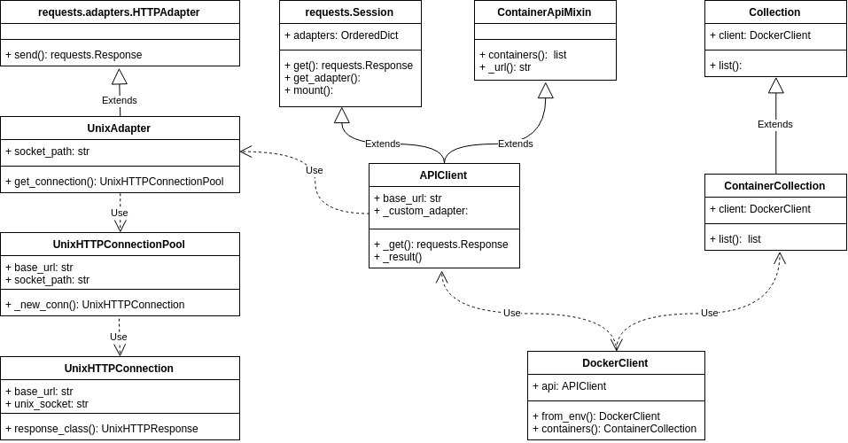

# Docker SDK
Docker 引擎采用的是非常常见的客户端 / 服务器架构. 既然分成了两部分, 那它们之间就一定有数据通信的需求. 若要通信, 就得考虑如何定义信息格式. 格式定义的方式有很多种, Docker 选择了流行的 REST 风格 API.

REST 并不是什么技术框架, 只不过是一种 API 的设计风格, 而且通常基于 HTTP 使用. 嗯, 好像没什么特别的, 就像一个普通的 Web 服务, 客户端使用 HTTP 发起请求一样. 可是, 通过客户端代码, 还是会发现一些有意思的地方. 下面就从最早的 `0.0.2` 版本看起.

## 初始版本
`0.0.2` 是 `docker-py` 最早的一个标签版本了, 主体就一个文件, 看上去出奇的简单. 选择一部分出来, 就像下面这样.

```python
import requests


class Client(requests.Session):
    def __init__(self, base_url="http://localhost:4243"):
        super(Client, self).__init__()
        self.base_url = base_url

    def _url(self, path):
        return self.base_url + path

    def _result(self, response, json=False):
        if response.status_code != 200:
            response.raise_for_status()
        if json:
            return response.json()
        return response.text

    def containers(self, quiet=False, all=False, trunc=True, latest=False, since=None, before=None, limit=-1):
        params = {
            'limit': 1 if latest else limit,
            'only_ids': 1 if quiet else 0,
            'all': 1 if all else 0,
            'trunc_cmd': 1 if trunc else 0,
            'since': since,
            'before': before
        }
        u = self._url("/containers/ps")
        return self._result(self.get(u, params=params), True)
```

客户端直接使用 `requests` 库发送 HTTP 请求. 比如现在要获取设备中有哪些容器, 就可以使用 `containers` 方法. 这一步会发送一个 GET 请求, URL 是 [http://localhost:4243/containers/ps](http://localhost:4243/containers/ps). 经过服务端, 也就是 `docker daemon` 处理后, 结果会附加在响应体中发送回来.

很好, 找到了一个 API 接口. 注意到这个接口使用的是 GET 请求, 那么使用浏览器是不是也能得到结果? 打开链接就会发现, 根本没有服务器在服务这个地址.

事实上, 现在的 Docker 服务端已经更改了接口地址, `0.0.2` 版本的客户端也不再能使用. 不过可以明白的一点是 Docker 客户端与服务端本质上是通过基于 HTTP 的 REST 接口交互的, 客户端既可以是安装后自带的命令行程序, 也可以是各种语言中的 SDK.

## 当前版本
初始版本用不了, 只好往后找新版本来看. 较新的 `3.4.0` 版本已经发生了很大的变化, 从原来的一个文件几百行代码发展为了上百个文件, 不过我们只要看其中的一小部分就好了.

在新版本中, 我认为最值得注意的一个地方是客户端和服务器默认使用了 Unix domain socket 来实现 REST 通信, 而不是常见的 TCP 方式, 所以后面就主要来看这部分是如何实现的.

### 客户端的基本结构
选择显示所有容器为线索.
```python
import docker

client = docker.from_env()
print(client.containers.list())
```

在整个过程中主要涉及到以下一些类.
<div align="center">  </div><br>

在最开始, `from_env` 的作用是使用环境变量构建一个客户端 `DockerClient`. 通过客户端, 我们可以使用 Docker daemon 提供的所有管理功能, 比如管理 Docker daemon 的配置, 管理容器, 管理镜像等等. 所有这些管理功能都被组织在单独的类当中, 又以客户端属性的形式对外提供调用.

```python
class DockerClient(object):

    @property
    def containers(self):
        """
        An object for managing containers on the server.
        """
        return ContainerCollection(client=self)
```

`DockerClient` 将所有的功能整合到了一起, 抽象出一种更简单的调用方式, 其下层与服务器交互的部分由 `APIClient` 实现.

### Mixin

`APIClient` 的实现方式实现方式非常特别, 它有很多的父类.

```python
class APIClient(
        requests.Session,
        BuildApiMixin,
        ConfigApiMixin,
        ContainerApiMixin,
        DaemonApiMixin,
        ExecApiMixin,
        ImageApiMixin,
        NetworkApiMixin,
        PluginApiMixin,
        SecretApiMixin,
        ServiceApiMixin,
        SwarmApiMixin,
        VolumeApiMixin):
```

这样的写法在服务器的实现中也见到过, 通过多重继承来拓展类的功能. `APIClient` 最基本的一个父类还和初始版本一样, 是 `requests.Session`, 从而获得收发 HTTP 数据的功能. 然后再继承组织在一个个 `mixin` 类中的用来与不同 API 交互的方法.

`mixin` 类通常只有与实现新功能相关的代码, 因而不能单独使用.  比如在 `ContainerApiMixin` 中的方法可以用来构建与容器相关的请求, 但是请求如何发送, 结果如何解析仍然需要 `APIClient` 中的 `_get`, `_result` 等方法.

```python
class ContainerApiMixin(object):

    def containers(self, quiet=False, all=False, trunc=False, latest=False,
                 since=None, before=None, limit=-1, size=False,
                 filters=None):
      params = {
          'limit': 1 if latest else limit,
          'all': 1 if all else 0,
          'size': 1 if size else 0,
          'trunc_cmd': 1 if trunc else 0,
          'since': since,
          'before': before
      }
      if filters:
          params['filters'] = utils.convert_filters(filters)
      u = self._url("/containers/json")
      res = self._result(self._get(u, params=params), True)

      if quiet:
          return [{'Id': x['Id']} for x in res]
      if trunc:
          for x in res:
              x['Id'] = x['Id'][:12]
      return res
```

使用 `mixin` 方式的多重继承, 可以减少命名冲突, 以及随之而来的因方法重写造成的混乱. 关于多重继承时 `super()` 如何工作可以查看这里的 [解释 &raquo;](https://stackoverflow.com/a/3277407).

### Base URL
Base URL 用于指定要与之通信的 Docker daemon 地址. 这个地址可以在初始化客户端 `DockerClient` 时指定, 当然也可以使用默认值.

```python
client = docker.DockerClient(base_url='unix://var/run/docker.sock')
```

用户提供的 URL 要经过函数 `parse_host` 处理, 如果用户没有提供也要由它赋上默认值. 由这个函数可以了解到 Docker daemon 支持下面几个应用层协议:
1.  `http+unix`

    默认值, 应该不算是标准协议类型, 用于在同一个 Unix 类系统中的客户端和服务器的通信. 默认的 Socket 位于 `/var/run/docker.sock`.

    这种类型的 URL 在 `APIClient.__init__` 中又会被转换为 `http+docker://localhost`. 我不清楚为什么这么做, 可能是为了符合 URL 的格式, 毕竟在 host 部分不应该出现 `/`.

1.  `npipe`

    与系统类型相关. 如果是 Windows 系统, 则采用命名管道的通信方式.

1.  `http(s)`

如果客户端要向服务器发起请求, 不论采取了何种协议, 都是将特定的 REST API 添加在 base url 之后. 这个工作由 `APIClient._url` 完成.

比如要获取容器信息, `ContainerApiMixin` 会使用下面的语句生成 URL.

```Python
u = self._url("/containers/json")
```

得到的结果为 `http+docker://localhost/v1.35/containers/json`. 对比初始版本的 API `http://localhost:4243/containers/ps` 就可以看出差异了.

对比新旧两种 API, 可以看到在新版本中增加了 API 的版本信息. 这也是在 REST 设计中常见的做法, 它使得服务端在接口更新后具备向下的兼容性.

### 更改 daemon 的监听接口
原来我们是可以通过 TCP 与 daemon 进行通信的, 这样就能在浏览器上访问 REST 接口了.

通过下面的步骤更改 daemon 设置.

```shell
# 修改配置文件 /etc/docker/daemon.json
# 添加 host 记录, "hosts": ["tcp://127.0.0.1:4567"]
$ sudo vim /etc/docker/daemon.json

# 关闭 docker 服务
$ sudo service docker stop

# 手动启动 daemon
$ dockerd
```

设置好后, 访问 [http://127.0.0.1:4567/v1.35/containers/json](http://127.0.0.1:4567/v1.35/containers/json) 即可得到运行中的容器信息列表.

如何得到全部的容器信息? 从 `ContainerApiMixin.containers` 中可以找到能够使用的限定参数, 这样就能得到全部信息了 [http://127.0.0.1:4567/containers/json?all=1](http://127.0.0.1:4567/containers/json?all=1) .


## 参考资料
- [What is a mixin, and why are they useful?](https://stackoverflow.com/a/547714)
- [Mixins and Python](https://www.ianlewis.org/en/mixins-and-python)
- [Configure the Docker daemon](https://docs.docker.com/config/daemon/#configure-the-docker-daemon)
