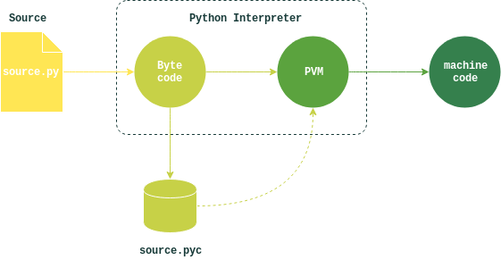

# Python 程序是如何运行起来的
<div align="center">  </div><br>

图中表示了标准实现 CPython 的执行过程, 不同实现间存在差异.

## Python 解释器

Python 既指一门编程语言, 也用来指解释器软件, 用于将源程序解释为处理器可以理解执行的机器语言.

Python 解释器有多种实现:
- **CPython: The standard**

  使用 C 语言的标准实现.

- **Jython: Python for Java**

  它将 Python 源码编译为 Java 字节码, 并使用 JVM 执行, 以便与 Java 程序集成.

- **IronPython: Python for .NET**

  为实现与 .Net 程序的集成.

- **Stackless: Python for concurrency**

  这一实现不在 C 语言的调用栈中保存状态, 而是使用协程或微线程等技术代替标准实现中的多线程和多进程.

- **PyPy: Python for speed**

  PyPy 包括一个及时 (JIT) 编译器, 运行沙盒, 还支持 Stackless 和微线程以实现大规模并发. PyPy 能使程序达到更快的运行速度.

## 执行过程

### 编译为字节码

在执行 Python 程序时, 源文件会先被编译为字节码. 字节码是源文件的底层表示方式, 与平台无关, 执行速度更快.

文件 A 在被文件 B 引用时, 解释器会将 A 的字节码保存下来, 以备未来使用.

字节码文件以 `.pyc` 作为后缀, 表示编译过的 `.py`, 保存在源码文件中的 `__pycache__` 子文件夹下. 字节码的名称中还保存了解释器的版本信息, 比如, `script.cpython-36.pyc`.

通过保存字节码文件可以加速启动过程. 程序再次运行时, 就可以跳过编译为字节码的步骤, 直接加载之前的编译结果.

什么时候重新生成字节码:
- **源码变动时**

  Python 通过检查 `last-modified` 时间戳来判断文件是否有修改;

- **用了不同的 Python 版本**

  拿字节码文件名中的版本信息和当前解释器版本作比较就可以了.

解释器没有文件的写权限也没有关系, 只不过生成的字节码只能临时保存在内存中, 用完就丢掉了.

有了字节码, 即使没有程序源文件解释器也可以执行程序.

```shell
python script.cpython-36.pyc
```

### 由 Python 虚拟机执行

字节码最终要交给 PVM 执行. 不过 PVM 并不是单独的软件需要单独安装, 它不过是一个循环的代码段, 对照着字节码中的指令一条条执行, 直到运行结束.

从 Python 程序的执行过程可以看出它与编译型语言不同的地方:
- 源码直接交给解释器执行, 没有构建或 `make` 的过程;
- 字节码不能直接由处理器执行;

在性能上, 编译型语言在运行前已经构建为机器码可以直接运行, 而 Python 字节码需要通过 PVM 执行, 所以比编译型语言运行慢. 但在另一方面, Python 不用重复解析源文件, 所以又要比传统解释型语言快.


## 参考资料
- Learning Python, 5th Edition
